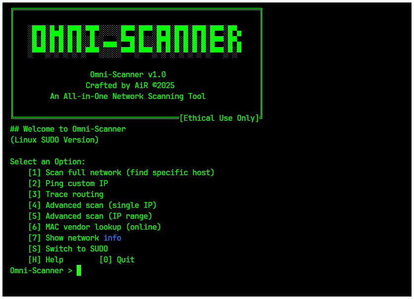

# 🔍 Omni-Scanner: Comprehensive Network Scanning Tool


**Discover devices. Understand your network. Stay secure.**

Omni-Scanner is a professional-grade, Python-based network scanning tool that combines simplicity with power. Whether you're learning network security, performing ethical hacking, or securing your own infrastructure, Omni-Scanner provides the tools you need.

---

## 🚀 Features

### Core Scanning Capabilities
* 🕵️ **ARP Discovery** — Find all devices on your local network
* 📡 **Intelligent Ping** — Custom packet sizes, flood ping, latency analysis
* �️ **Traceroute** — Visualize network paths and identify bottlenecks
* 🔦 **Advanced Nmap Integration** — OS detection, service fingerprinting, stealth scans

### Modern Interface Options
* 💻 **Command Line Interface** — Scriptable, automation-friendly
* � **Interactive Menu** — User-friendly guided experience
* 📊 **Multiple Export Formats** — JSON, CSV, HTML reports
* 📈 **Progress Tracking** — Real-time scan progress with detailed logging

### Security & Performance
* � **Input Validation** — Secure parameter handling
* ⚡ **Concurrent Scanning** — Parallel operations for speed
* 🛡️ **Firewall Evasion** — Advanced techniques for comprehensive scanning
* 📝 **Comprehensive Logging** — Detailed audit trails

---

## 🛠️ Installation

### 🚀 **Automated Setup (Recommended)**

For the easiest setup experience, use our automatic setup script that handles virtual environments and dependencies:

```bash
# Clone the repository
git clone https://github.com/kartik2005221/Omni-Scanner.git
cd Omni-Scanner

# Run the automatic setup script
python setup.py
```

**What the setup script does:**
- ✅ Creates a virtual environment (.venv)
- ✅ Installs all Python dependencies
- ✅ Creates platform-specific activation scripts
- ✅ Provides clear usage instructions

**After setup, activate the environment:**

**Windows:**
```bash
# Option 1: Use the activation script
.\activate.bat

# Option 2: Manual activation
.venv\Scripts\activate
python main.py
```

**Linux/macOS:**
```bash
# Option 1: Use the activation script
./activate.sh

# Option 2: Manual activation
source .venv/bin/activate
python main.py
```

### 🔧 **Operating System Preparation**

⚠️ **Important Notes:**
- **First startup takes 1-3 minutes** while dependencies install. Please wait!
- **Some scans require elevated privileges** (Administrator/sudo)
- **Large networks** may take significant time to scan completely
- **Firewall/antivirus** may interfere with scanning - configure exceptions if needed

### ⏱️ **Performance & Timing Guidelines**

#### **Timing Templates for Nmap Scans**

| Template | Speed | Detection Risk | Use Case | Typical Duration |
|----------|-------|----------------|----------|------------------|
| **T0** (Paranoid) | Slowest | Minimal | IDS evasion, stealth | 10-30 minutes |
| **T1** (Sneaky) | Slow | Low | Careful reconnaissance | 5-15 minutes |
| **T2** (Polite) | Moderate | Medium | Production networks | 2-8 minutes |
| **T3** (Normal) | Standard | Medium | General purpose | 1-5 minutes |
| **T4** (Aggressive) | Fast | High | Internal networks | 30s-2 minutes |
| **T5** (Insane) | Fastest | Highest | Lab environments | 10-60 seconds |

#### **Scan Duration Factors**
- **Network size**: Single host vs. subnet (/24 = 254 hosts)
- **Port range**: Top 100 ports vs. full 65,535 ports  
- **Service detection**: Adds 2-5x time but provides valuable info
- **OS detection**: Adds 1-3x time for fingerprinting
- **Network latency**: High-latency connections slow all scans

#### **Startup Performance Tips**
```bash
# Quick dependency check (instant)
omni-scanner system-deps --check

# Fast initial test (30 seconds)
omni-scanner nmap 8.8.8.8 --top-ports 100 --timing T4

# Thorough but slow reconnaissance (10+ minutes)  
omni-scanner nmap target.com --timing T1 --service-detect --os-detect

# Balanced approach (2-5 minutes)
omni-scanner nmap 192.168.1.0/24 --top-ports 1000 --timing T3
```

#### **Windows Setup**

1. **Install Python 3.8+**
   ```bash
   # Download from python.org or use winget
   winget install Python.Python.3.11
   ```

2. **Install Nmap**
   ```bash
   # Download from https://nmap.org/download.html
   # Or use chocolatey
   choco install nmap
   ```

3. **Install Npcap** (Required for packet capture)
   - Download from: https://npcap.com/
   - Install with "WinPcap API-compatible mode" enabled

4. **Run as Administrator** (for some scan types)

#### **Ubuntu/Debian Setup**

```bash
# Update package lists
sudo apt update

# Install Python and pip
sudo apt install python3 python3-pip python3-venv

# Install system tools
sudo apt install nmap arp-scan traceroute net-tools

# Install build tools (for some Python packages)
sudo apt install build-essential libpcap-dev

# Clone and setup
git clone https://github.com/kartik2005221/Omni-Scanner.git
cd Omni-Scanner
python3 setup.py
```

#### **CentOS/RHEL/Fedora Setup**

```bash
# Install Python and tools
sudo dnf install python3 python3-pip nmap traceroute

# For arp-scan (may need EPEL repository)
sudo dnf install epel-release
sudo dnf install arp-scan

# Or compile from source if not available
git clone https://github.com/royhills/arp-scan.git
cd arp-scan
autoreconf --install
./configure
make
sudo make install
```

#### **macOS Setup**

```bash
# Install Homebrew if not already installed
/bin/bash -c "$(curl -fsSL https://raw.githubusercontent.com/Homebrew/install/HEAD/install.sh)"

# Install required tools
brew install python3 nmap arp-scan

# Clone and setup
git clone https://github.com/kartik2005221/Omni-Scanner.git
cd Omni-Scanner
python3 setup.py
```

#### **Arch Linux Setup**

```bash
# Install required packages
sudo pacman -S python python-pip nmap traceroute

# Install arp-scan from AUR
yay -S arp-scan

# Clone and setup
git clone https://github.com/kartik2005221/Omni-Scanner.git
cd Omni-Scanner
python setup.py
```

#### **📱 Termux Setup (Android)**

```bash
# Update packages
pkg update && pkg upgrade

# Install required packages
pkg install python git nmap arp-scan traceroute iputils

# Clone and setup
git clone https://github.com/kartik2005221/Omni-Scanner.git
cd Omni-Scanner
python setup.py

# For enhanced privileges (optional)
pkg install tsu
```

**📝 Termux Notes:**
- 🔒 **Root access**: Install `tsu` for root privileges if needed
- 🌐 **Network**: Works best on local WiFi networks
- 🔋 **Battery**: Disable battery optimization for Termux
- 📱 **Permissions**: Grant storage and network permissions

### ⚡ **Quick Install (Manual)**

If you prefer manual installation:

```bash
# Clone and install
git clone https://github.com/kartik2005221/Omni-Scanner.git
cd Omni-Scanner
pip install -e .

# Run with CLI
omni-scanner --help

# Or run interactive mode
python main.py
```

### Prerequisites

**System Requirements:**
* Python 3.8+
* Administrator/root privileges (for some scans)

**Required Tools:**
* `nmap` — [Download Nmap](https://nmap.org/download.html)
* **Linux/macOS:** `arp-scan` and `traceroute`
  ```bash
  # Ubuntu/Debian
  sudo apt install nmap arp-scan traceroute
  
  # macOS
  brew install nmap arp-scan
  ```
* **Windows:** [Npcap](https://npcap.com/) for low-level network access

### Development Installation

```bash
git clone https://github.com/kartik2005221/Omni-Scanner.git
cd Omni-Scanner

# Install with development dependencies
pip install -e ".[dev]"

# Run tests
pytest tests/

# Format code
black .
```

---

## 🎯 Quick Start

### Command Line Interface (Recommended)

```bash
# ARP scan local network
omni-scanner arp

# ARP scan specific network
omni-scanner arp 192.168.1.0/24 --fast

# Ping with custom options
omni-scanner ping 8.8.8.8 --count 10 --size 1024

# Traceroute with timeout
omni-scanner traceroute google.com --timeout 3

# Nmap port scan
omni-scanner nmap 192.168.1.1 --ports 1-1000

# Advanced Nmap with service detection
omni-scanner nmap 192.168.1.1 --service-detect --os-detect

# Export results in different formats
omni-scanner arp --format html --output network_scan
```

### Interactive Mode

```bash
python main.py
```

Choose from menu options for guided scanning experience.

---

## 📋 Usage Examples

### Basic Network Discovery

```bash
# Find all devices on local network
omni-scanner arp --format html

# Scan specific subnet
omni-scanner arp 10.0.0.0/24 --output my_network
```

### Advanced Port Scanning

#### 🎯 Top Ports Scanning (NEW!)
```bash
# Scan top 100 most common ports (fastest for discovery)
omni-scanner nmap 192.168.1.100 --top-ports 100

# Scan top 1000 ports for comprehensive coverage
omni-scanner nmap 192.168.1.100 --top-ports 1000

# Quick scan of top 20 ports
omni-scanner nmap 192.168.1.100 --top-ports 20
```

#### 🔧 Custom Port Scanning
```bash
# Quick port scan (specific ports)
omni-scanner nmap 192.168.1.100 --ports 80,443,22,21

# Port range scanning
omni-scanner nmap 192.168.1.100 --ports 1-1000

# Comprehensive scan with service detection
omni-scanner nmap 192.168.1.100 --ports 1-65535 --service-detect --timing T4
```

#### ⚡ Timing Templates
```bash
# T0: Paranoid (slowest, stealthiest) - evades IDS
omni-scanner nmap 192.168.1.100 --timing T0 --top-ports 100

# T1: Sneaky (slow, less likely to be detected)
omni-scanner nmap 192.168.1.100 --timing T1 --service-detect

# T2: Polite (slower than normal, less bandwidth)
omni-scanner nmap 192.168.1.100 --timing T2 --ports 1-1000

# T3: Normal (default timing)
omni-scanner nmap 192.168.1.100 --timing T3 --top-ports 500

# T4: Aggressive (faster, assumes good network)
omni-scanner nmap 192.168.1.100 --timing T4 --service-detect --os-detect

# T5: Insane (fastest, may miss hosts/ports)
omni-scanner nmap 192.168.1.100 --timing T5 --top-ports 1000
```

#### 🕵️ Stealth & Detection
```bash
# Stealth scan with firewall evasion
omni-scanner nmap 192.168.1.100 --firewall-evasion --ports 1-1000

# OS detection scan
omni-scanner nmap 192.168.1.100 --os-detect --top-ports 100

# Service version detection
omni-scanner nmap 192.168.1.100 --service-detect --ports 80,443,22

# Full stealth reconnaissance
omni-scanner nmap 192.168.1.100 --timing T1 --service-detect --os-detect --top-ports 200
```

#### 🎭 Scan Types
```bash
# SYN scan (default, stealthy)
omni-scanner nmap 192.168.1.100 --scan-type syn --top-ports 100

# TCP Connect scan (more reliable)
omni-scanner nmap 192.168.1.100 --scan-type tcp --ports 1-1000

# UDP scan (for UDP services)
omni-scanner nmap 192.168.1.100 --scan-type udp --top-ports 100

# Ping scan (host discovery only)
omni-scanner nmap 192.168.1.0/24 --scan-type ping

# ACK scan (firewall testing)
omni-scanner nmap 192.168.1.100 --scan-type ack --ports 1-1000
```

### 🌐 DNS Lookup & Resolution (NEW!)

#### Forward DNS Lookup
```bash
# Basic DNS lookup
omni-scanner dns google.com

# Multiple domains lookup
omni-scanner dns google.com cloudflare.com github.com

# DNS lookup with specific record types
omni-scanner dns google.com --record-type MX
omni-scanner dns github.com --record-type AAAA
omni-scanner dns cloudflare.com --record-type TXT
```

#### Reverse DNS Lookup
```bash
# Reverse DNS lookup (IP to domain)
omni-scanner reverse-dns 8.8.8.8

# Multiple IP reverse lookup
omni-scanner reverse-dns 8.8.8.8 1.1.1.1 208.67.222.222

# Subnet reverse DNS scan
omni-scanner reverse-dns 192.168.1.1 192.168.1.254
```

#### Bulk DNS Operations
```bash
# Bulk DNS lookup from file
omni-scanner bulk-dns domains.txt --output dns_results

# Bulk reverse DNS lookup
omni-scanner bulk-dns ip_list.txt --reverse --output reverse_dns_results
```

#### Advanced DNS Features
```bash
# All supported record types: A, AAAA, MX, TXT, NS, CNAME, SOA
omni-scanner dns example.com --record-type A      # IPv4 addresses
omni-scanner dns example.com --record-type AAAA   # IPv6 addresses  
omni-scanner dns example.com --record-type MX     # Mail servers
omni-scanner dns example.com --record-type TXT    # Text records
omni-scanner dns example.com --record-type NS     # Name servers
omni-scanner dns example.com --record-type CNAME  # Canonical names
omni-scanner dns example.com --record-type SOA    # Start of Authority
```

### Connectivity Testing

```bash
# Basic connectivity test
omni-scanner ping 8.8.8.8

# Detailed latency analysis
omni-scanner ping 8.8.8.8 --count 100 --size 64

# Flood ping (requires sudo on Linux)
sudo omni-scanner ping 192.168.1.1 --flood --count 1000
```

### Network Path Analysis

```bash
# Basic traceroute
omni-scanner traceroute google.com

# Advanced traceroute with custom settings
omni-scanner traceroute 8.8.8.8 --max-hops 20 --timeout 5
```

### 📱 Termux Examples (Android)

```bash
# Check system dependencies first
omni-scanner system-deps --check

# Quick WiFi network discovery
omni-scanner arp 192.168.1.0/24

# Fast port scan with mobile-friendly timing
omni-scanner nmap 192.168.1.1 --top-ports 100 --timing T4

# Lightweight connectivity test
omni-scanner ping 8.8.8.8 --count 10

# DNS lookup (no special permissions needed)
omni-scanner dns google.com

# Traceroute to troubleshoot mobile connectivity
omni-scanner traceroute 1.1.1.1

# Root scanning (if tsu is installed)
tsu
omni-scanner nmap 192.168.1.0/24 --top-ports 1000 --service-detect
```

**📝 Termux Best Practices:**
- 🔋 Use `--timing T4` or `T5` for faster scans (saves battery)
- 📶 Connect to WiFi for better network access
- 🔒 Install `tsu` for root privileges if needed
- 💾 Use `--output` to save results in accessible storage

---

## 🔧 Configuration Options

### CLI Arguments

```bash
# Global options
--verbose, -v          Enable verbose output
--quiet, -q           Suppress output except errors
--log-file FILE       Custom log file path

# Output options
--format FORMAT       Output format: json, csv, html
--output FILE         Output filename (without extension)

# Scan-specific options vary by command
omni-scanner COMMAND --help  # For detailed options
```

### Environment Variables

```bash
export OMNI_SCANNER_LOG_LEVEL=DEBUG
export OMNI_SCANNER_DEFAULT_FORMAT=json
export OMNI_SCANNER_OUTPUT_DIR=./my_scans
```

---

## 📊 Output Formats

### JSON (Default)
```json
{
  "scan_type": "nmap",
  "timestamp": "2023-01-01T12:00:00",
  "hosts": [
    {
      "address": "192.168.1.1",
      "ports": [
        {"port": 22, "protocol": "tcp", "state": "open", "service": "ssh"},
        {"port": 80, "protocol": "tcp", "state": "open", "service": "http"}
      ]
    }
  ],
  "summary": {
    "total_addresses": 1,
    "hosts_up": 1,
    "hosts_down": 0
  }
}
```

### CSV
Tabular data perfect for spreadsheet analysis and reporting.

### HTML
Rich, interactive reports with charts and colored status indicators.

---

## 🧪 Testing

```bash
# Run all tests
pytest

# Run specific test suite
pytest tests/test_scan_builders.py

# Run with coverage
pytest --cov=utils tests/

# Run integration tests (requires network access)
pytest tests/integration/
```

---

## 🤝 Contributing

We welcome contributions! Please see our [Contributing Guide](CONTRIBUTING.md) for details.

### Development Workflow

1. Fork the repository
2. Create a feature branch: `git checkout -b feature/amazing-feature`
3. Make your changes and add tests
4. Run the test suite: `pytest`
5. Format your code: `black .`
6. Commit your changes: `git commit -m 'Add amazing feature'`
7. Push to your branch: `git push origin feature/amazing-feature`
8. Open a Pull Request

---

## 📈 Roadmap

### v1.1.0 (Coming Soon)
- [ ] Web dashboard interface
- [ ] Docker container support
- [ ] Plugin architecture for custom scans
- [ ] Database integration for scan history

### v1.2.0 (Future)
- [ ] Machine learning for anomaly detection
- [ ] REST API for integration
- [ ] Multi-threaded scanning engine
- [ ] Vulnerability database integration

---

## ⚠️ Legal Disclaimer

**Use Responsibly:** This tool is designed for educational purposes and authorized security testing only. Users are responsible for complying with applicable laws and regulations. Only scan networks you own or have explicit permission to test.

**Not for Malicious Use:** The developers are not responsible for any misuse of this software.

---

## 📄 License

This project is licensed under the MIT License - see the [LICENSE](LICENSE) file for details.

---

## 🙏 Acknowledgments

* The Nmap Project for the excellent scanning engine
* The Python community for amazing libraries
* Security researchers who make networks safer
* Contributors who help improve this tool

---

## 📞 Support

* 🐛 **Bug Reports:** [GitHub Issues](https://github.com/kartik2005221/Omni-Scanner/issues)
* 💡 **Feature Requests:** [GitHub Discussions](https://github.com/kartik2005221/Omni-Scanner/discussions)
* 📖 **Documentation:** [Wiki](https://github.com/kartik2005221/Omni-Scanner/wiki)
* 💬 **Community:** [Discord Server](#) (Coming Soon)

---

<div align="center">

**⭐ Star this repository if you find it helpful!**

Made with ❤️ for the cybersecurity community

</div>
   sudo python3 main.py
   ```

   OR (on Windows):

   ```bash
   python main.py
   ```

> 💡 **Having issues?** Double-check the requirements or [open an issue](https://github.com/kartik2005221/Omni-Scanner/issues).

---

## 🖥️ Screenshots

**Interactive Menu**


---

## ⚠️ Responsible Use

This tool is for **educational and authorized use only**.

✅ Only scan networks you own or have clear permission to test.

⛔ Never use this tool for illegal activities — misuse is strictly prohibited.

*Omni-Scanner is meant to promote security awareness, not exploitation.*

---

## 🤝 Contributing

Contributions are welcome!

* Found a bug? [Open an issue](https://github.com/kartik2005221/Omni-Scanner/issues) with the "Bug" label
* Got a feature idea? Suggest it under "Enhancement"
* Want to code? Fork the repo, make your changes, and submit a pull request

---

## ☕ Support My Work

If this tool helped you, consider supporting:

* **UPI (India):** [kartik2005221@upi](docs/media/QR_1744889718.png)
* **PayPal:** [paypal.me/kartik2005221](https://paypal.me/kartik2005221)

*Your support helps me keep building open-source tools like this!*

---

## 📜 License

Released under the **MIT License** — see [LICENSE](LICENSE) for full details.

---

## 📬 Contact

[](mailto:kartik2005221@proton.me)
[](https://github.com/kartik2005221)
[](https://www.linkedin.com/in/kartik2005221/)

---

**Made with ❤️, Python, and a bit of curiosity.**

*Secure networks. Learn continuously. Stay ethical.*
